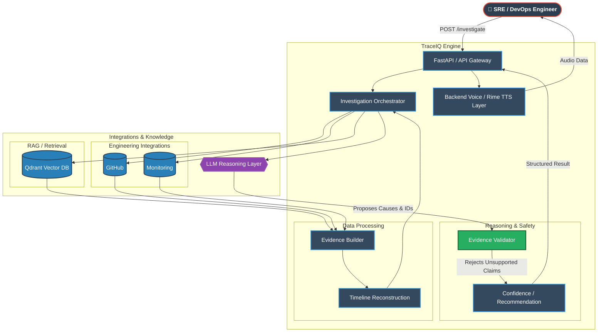
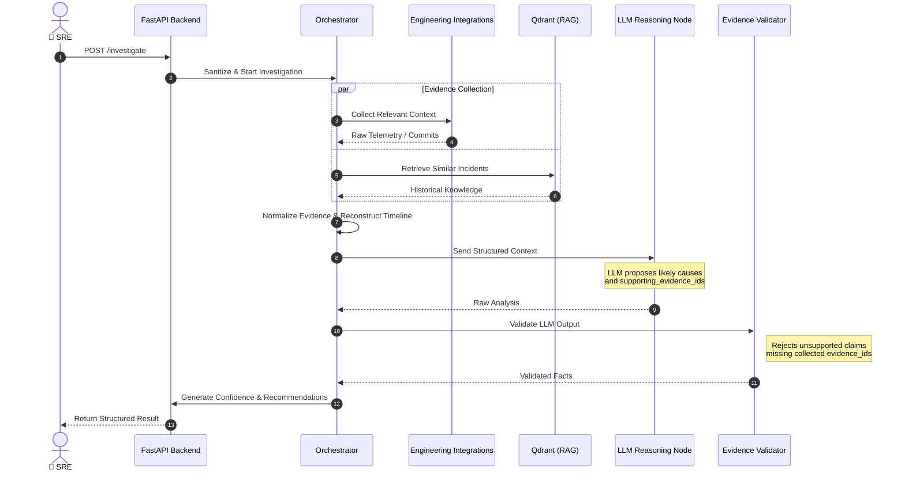

<div align="center">

# 🌌 TRACEIQ
### Voice-First Incident Intelligence Platform

[](https://python.org)
[](https://fastapi.tiangolo.com/)
[](https://www.docker.com/)
[](https://qdrant.tech/)

*Elevating Site Reliability Engineering through deterministic AI and voice interaction.*

</div>

---

## 💎 The Vision

Software engineering and DevOps teams waste precious minutes—often hours—gathering context during critical production incidents. Cross-referencing logs, metrics, Git commits, and historical runbooks manually is a slow, archaic, and error-prone process.

**TraceIQ** redefines the incident response paradigm. 

Instead of typing queries across five different dashboards, an engineer simply speaks to TraceIQ. Operating as an elite, AI-driven Incident Analyst, TraceIQ autonomously aggregates context, cross-references historical data, and delivers deterministic, evidence-backed recommendations directly back to the engineer via voice.

---

## ✨ Premium Features

| Capability | Description |
| :--- | :--- |
| 🎙️ **Voice-First Interface** | Natural language spoken queries transformed into structured investigations, enabling hands-free debugging during high-stress outages. |
| 🔗 **Evidence-Grounded Reasoning** | Likely causes and recommendations are required to reference validated `evidence_ids` collected from the available engineering context. Unsupported claims are rejected during evidence validation. |
| 🧠 **Intelligent Orchestration** | Asynchronous, modular pipeline combining LLM reasoning with rigorous programmatic validation. |
| 📚 **Historical Context Retrieval** | Deep integration with **Qdrant** to retrieve similar past incidents and runbook context using Qdrant vector search. |
| 📊 **Timeline Reconstruction** | Automatically generates chronologically accurate event sequences to pinpoint the exact moment of failure. |

---

## 🏗️ Detailed System Architecture

TraceIQ is built on a highly decoupled, modular architecture. Data collection, historical knowledge retrieval, LLM reasoning, evidence validation, timeline reconstruction, and recommendation generation are separated into clear components so that AI-generated conclusions remain grounded in verifiable engineering evidence.

### 1. Macro Component Flow

This diagram illustrates how the major subsystems of TraceIQ interact, showing the backend processing engine.



### 2. The Investigation Sequence (Data Flow)

What exactly happens when an engineer submits an investigation request? This sequence diagram maps the strict execution flow of the investigation pipeline.



### 3. TraceIQ Architecture Deep Dive

For a massive, in-depth explanation of every single microservice, component, and the strict evidence validation logic, please refer to the dedicated [Architecture Document](docs/ARCHITECTURE.md).

---

## 🚀 The Tech Stack

We utilize a state-of-the-art, modern stack engineered for speed, reliability, and precision.

### **Backend & Core Engine**
- **Framework:** `FastAPI` (Python 3.11+) - High-performance, asynchronous REST API.
- **Validation:** `Pydantic v2` - Strict schema enforcement.
- **Server:** `Uvicorn` - Lightning-fast ASGI server.
- **Observability:** `structlog` - Structured, contextual logging.

### **AI & Data Layer**
- **Vector Database:** `Qdrant` - Fast similarity search for historical incident resolution.
- **LLM Integration:** Modular LLM architecture supporting configurable providers.
- **Voice Synthesis:** `Rime API` - Ultra-realistic Text-to-Speech generation integrated via backend.
- **Transcription:** Modular STT provider configuration.

### **Infrastructure & Deployment**
- **Containerization:** `Docker` - Multi-stage builds for minimal, secure images.
- **Orchestration:** `Docker Compose` - Seamless local environment replication.
- **Hosting:** Configured for `Render` continuous deployment.

---

## 📂 Project Structure

A clean, domain-driven directory layout ensuring maintainability and scalability across the TraceIQ system.

```text
TraceIQ/
├── backend/                  
│   ├── app/
│   │   ├── api/              
│   │   ├── integrations/     
│   │   ├── rag/              
│   │   ├── schemas/          
│   │   ├── services/         
│   │   ├── middleware/       
│   │   └── utils/            
│   ├── tests/                
│   └── Dockerfile            
│
├── demo/                     
├── docs/                     
├── deployment/               
└── docker-compose.yml        
```

---

## ⚙️ Getting Started

Experience TraceIQ locally in minutes.

### Prerequisites
- Python `3.11` or higher
- `Make` utility
- (Optional) `Docker` & `Docker Compose`

### 1. Repository Setup
```bash
git clone https://github.com/StellarVisionAI/TraceIQ.git
cd TraceIQ
```

### 2. Environment Configuration
Copy the template and configure your secrets (LLM keys, Qdrant URLs).
```bash
cp .env.example .env
```
> **Note:** Set `DEMO_MODE=true` to allow the application to run using deterministic/synthetic incident data without requiring all external integrations. This is ideal for demonstrations.

### 3. Launch via Docker (Recommended)
```bash
make docker-build
make docker-run
```

### 4. Launch Native
```bash
make install
make dev
```
The API will be live at: **`http://localhost:8000`** 
Explore the Swagger UI at: **`http://localhost:8000/docs`**

---

## 🛡️ Security & Reliability

Security and reliability are built into the foundation:
- **Evidence-Grounded Output:** LLM-generated causes and recommendations are checked against validated `evidence_ids`. Unsupported evidence references are rejected before conclusions are returned.
- **Input Sanitization:** Native stripping of null bytes and malicious control characters.
- **Rate Limiting:** Built-in in-memory limits to prevent abuse.
- **Secret Management:** Absolute zero logging of API keys or sensitive variables.

*See [SECURITY.md](docs/SECURITY.md) for full details.*

---

## 👥 The Architects (StellarVisionAI)

- **Suryansh (Team Lead)** — Core Backend Architecture, Documentation, LLM Orchestration & Overall System Architecture
- **Yuvraj** — Retrieval-Augmented Generation (RAG), Qdrant Vector Database & Historical Knowledge Retrieval
- **Sparsh** — Backend Engineering, Integrations & Evidence Validation
- **Raghav** — Frontend React Application, Voice UI & Voice Interaction

---
<div align="center">
  <i>Built with precision for the StarForge Hackathon 2026.</i>
</div>