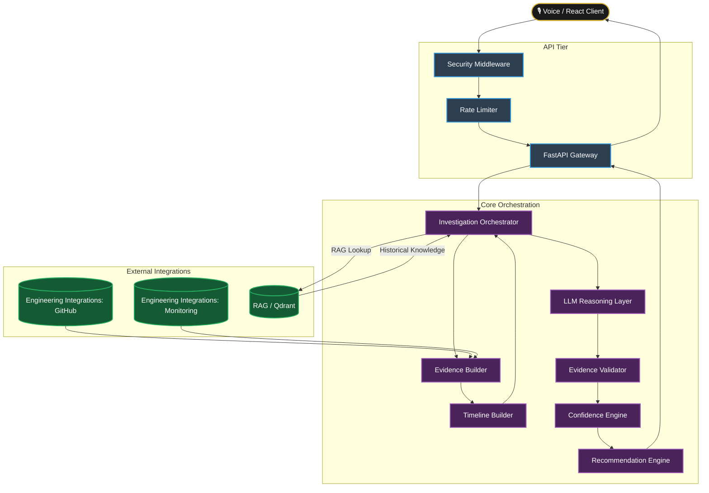

# 🏛️ Architecture Deep Dive
### TraceIQ Incident Intelligence Engine

---

## 🌟 Architectural Philosophy

TraceIQ is engineered around a central thesis: **AI in DevOps must be deterministic, transparent, and grounded.** We achieved this by decoupling the reasoning engine from the data collection tier, ensuring the LLM acts purely as an analytical node rather than a source of truth. The LLM is a reasoning component, not the source of engineering truth.

---

## 🏗️ The Macro Architecture

TraceIQ is built on a highly decoupled, modular architecture. Data collection, historical knowledge retrieval, LLM reasoning, evidence validation, timeline reconstruction, and recommendation generation are separated into clear components so that AI-generated conclusions remain grounded in verifiable engineering evidence.

---

## 🔍 Core Component Breakdown

### 1. The Investigation Orchestrator (`orchestrator.py`)
The conductor of the symphony. It operates entirely asynchronously, gathering data from `EngineeringContextProvider` (GitHub, Monitoring) and `KnowledgeRetriever` (Qdrant). It manages the exact lifecycle of an incident query.

### 2. Historical Knowledge Retrieval (RAG / Qdrant)
Qdrant provides historical knowledge to the investigation pipeline. It does not directly construct the incident timeline. The logical flow is:

`Investigation Query -> RAG Retrieval -> Qdrant Vector Search -> Relevant Historical Knowledge -> Investigation Orchestrator -> Evidence / Timeline Construction -> LLM Reasoning`

### 3. Evidence Builder & Timeline (`evidence_builder.py`, `incident_timeline.py`)
Data from disparate sources arrives in different formats. The Evidence Builder normalizes this into a strict `Evidence` schema, generating unique IDs. The Timeline Builder reconstructs events chronologically, providing the LLM with a causal sequence.

### 4. The LLM Reasoning Node (`llm.py`)
TraceIQ treats the LLM purely as a reasoning engine, not a knowledge base. It is fed the constructed investigation context and configured through system prompts to return structured JSON containing its analysis and supporting evidence references.

### 5. 🛡️ The Evidence Validator (`evidence_validator.py`)
This is a critical safety component of the TraceIQ investigation pipeline. The Validator checks `supporting_evidence_id` references against the collected evidence context and rejects unsupported claims. If an LLM-generated claim references evidence that is not present in the collected investigation context, the claim is rejected or excluded according to the validation logic.

### 6. Confidence & Recommendation Engines
Instead of faking mathematical probability, the Confidence Engine uses heuristics (source diversity, evidence volume) to grade the investigation. The Recommendation Engine prioritizes safe, actionable next steps.

---

## 🎭 Fallback & Demo Architecture

When DEMO_MODE=true, TraceIQ uses deterministic synthetic incident data through its demo-mode provider, allowing the investigation flow to be demonstrated without requiring all external integrations.
